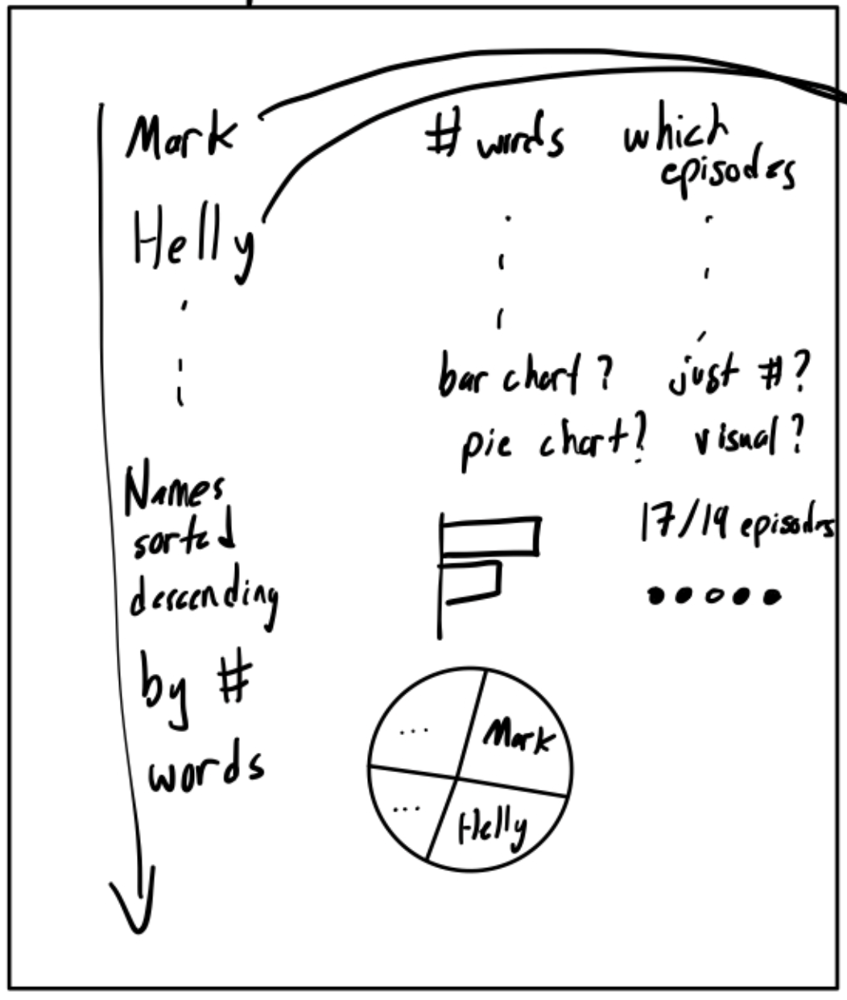
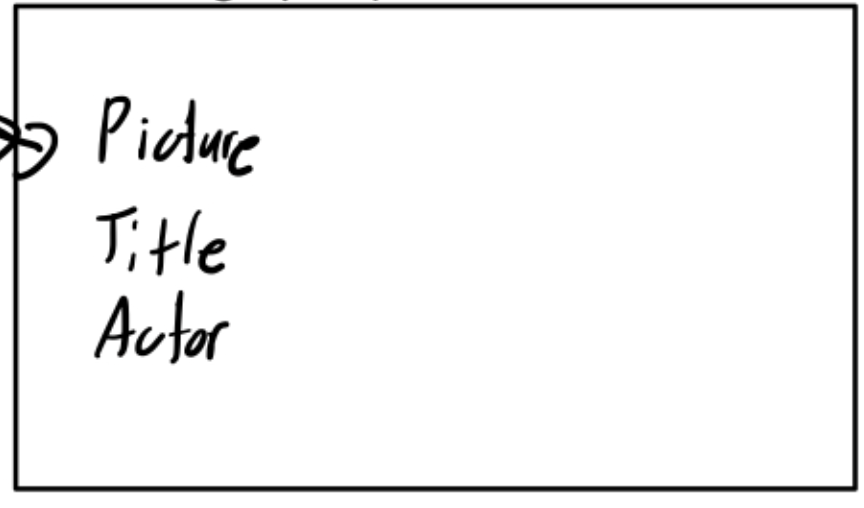
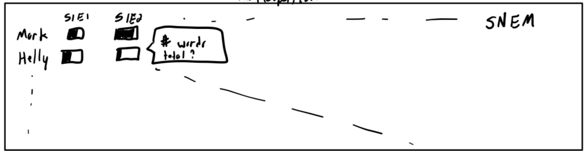
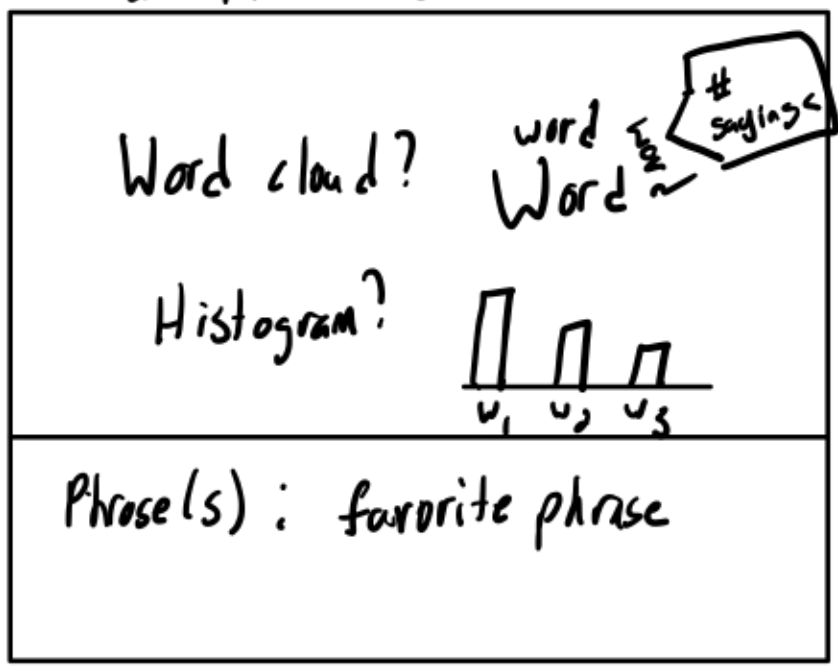
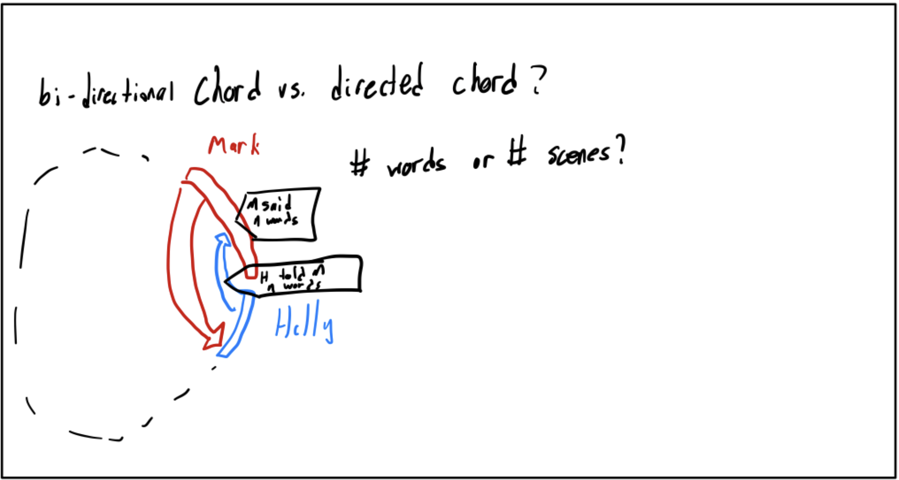
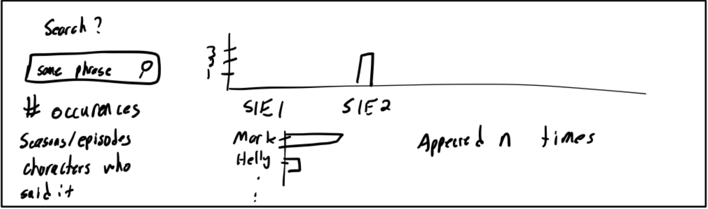

# Motivation
This project visualizes Severance transcripts so you can see speaking volume by character and season, word‑level detail for a selected character, episode participation, paired text exchanges between characters, and who says chosen phrases across episodes, instead of judging those patterns from memory alone. The motivation was to give a more quantitative aspect to the relationship between characters and how they speak/act.

# Data
# Vis Components
## Header
The header contains a blurb of the show, and information such as how many seasons the show has run for and how many total episodes - as well as the genre. We also chose to include the show logo in the header to invoke the design language of the show, which is very well defined and consistant throughout the show.

## Speaking Frequency
The Speaking Frequency view ranks the top 15 characters by total words spoken in the transcript data. It shows each character's rank, name, proportional word-count bar, exact word count, and episode-appearance dots. The All, Season 1, and Season 2 tabs filter the application to the selected season, causing the ranking, selected-character summary, heatmap, chord diagram, and phrase explorer to recompute from only the visible transcript rows. Clicking a character row selects that character and updates the Selected Character panel with that character's profile and dialogue statistics.

## Selected Character
The Selected Character panel acts as the detailed view for whichever character is currently active, defaulting to Mark Scout and changing when a user clicks a character in the ranking, heatmap cells, or phrase-owner chart. It displays the character image, name, role, external wiki link, total lines, total words spoken, number of episodes appeared in for the current season filter, actor, status, first appearance, and most spoken word or phrase. The word cloud below the facts shows that character's most frequent non-stop words, with larger words indicating higher frequency and hover tooltips giving the exact mention count.

## Episode Participation (Heatmap)
The Episode Participation heatmap compares how much each top character speaks in each episode, with characters as rows, episodes as columns, and darker cells representing more words spoken. Users can hover over cells to see the exact character, episode, and word count. Clicking a cell selects that character in the detail panel, as well as clicking character names, episode labels, or season labels to highlight subsets. You can also use the Brush control to drag-select a rectangular set of characters and episodes and use Clear selections to reset the heatmap. These selections update the heatmap's emphasis and color scaling so the selected rows, episodes, or season become easier to compare against the rest of the dashboard's current season filter.

## Text Exchange (Chord Diagram)
The Text Exchange chord diagram shows directed dialogue volume between the top characters in the current filter, where each outer arc represents a character and each ribbon represents words spoken from one character to another. The diagram updates when the season tabs change, so the conversation network reflects all episodes or a single season. Hovering over a ribbon highlights that exchange and shows how many words one character said to another, while hovering over an arc emphasizes that character and reports how many words they spoke and how many words were spoken to them.

## Phrase Ownership Explorer (Search Field)
The Phrase Ownership Explorer lets users type any word or phrase and see where that exact match appears in the transcripts. As the user types, the summary text reports total mentions and first episode, the timeline bar chart updates to show mentions by episode, and the owner bar chart updates to show which characters use the phrase most often. Hovering over bars reveals exact counts, and clicking a character in the owner chart selects that character in the detail panel, linking phrase search results back to the rest of the dashboard.

# Design Sketches & Justification
## L1
For level one, we started with a banner showing an overview of the show. This includes the tile, a description, and the number of episodes and seasons. This also expanded to include the genre of the show.

We also have both character importance and details. We decided on a vertical line of characters, each with a bar chart where the fill of the bar corresponds to the number of words and the filled in dots represent them being or not being in a given episode.

Clicking on a character from this list updates the pane to the right, which shows an image of the character, their title at Lumon, the actor that plays them, and more quantifiaction of their dialogue.

Episode participation is given (in addition to the importance visualization) with a matrix. Each cell represents an episode and their hue represents the characters participation in that episode. This makes it clear to see the dominant characters throughout the show.

## L2
We chose option 1 to begin with level 2. We show the common words a character speaks with a word cloud as that nicely captures this data. Their most common phrase is also displayed.

## L3
We did level 2 option 2 for this level. We decided on a directed chord chart as we feel that being able to see not just when characters interacted, but also who talked more/less during their interactions was interesting to see. 

## L4
We added the ability to search for a given phrase and examine how often it was said and who said it for level 4. We use a few charts, one temporal with occurences and one frequency per-character, to show how the query manifests throughout the show/cast.

# Discovery
# Process
# Demo Video
# Roles